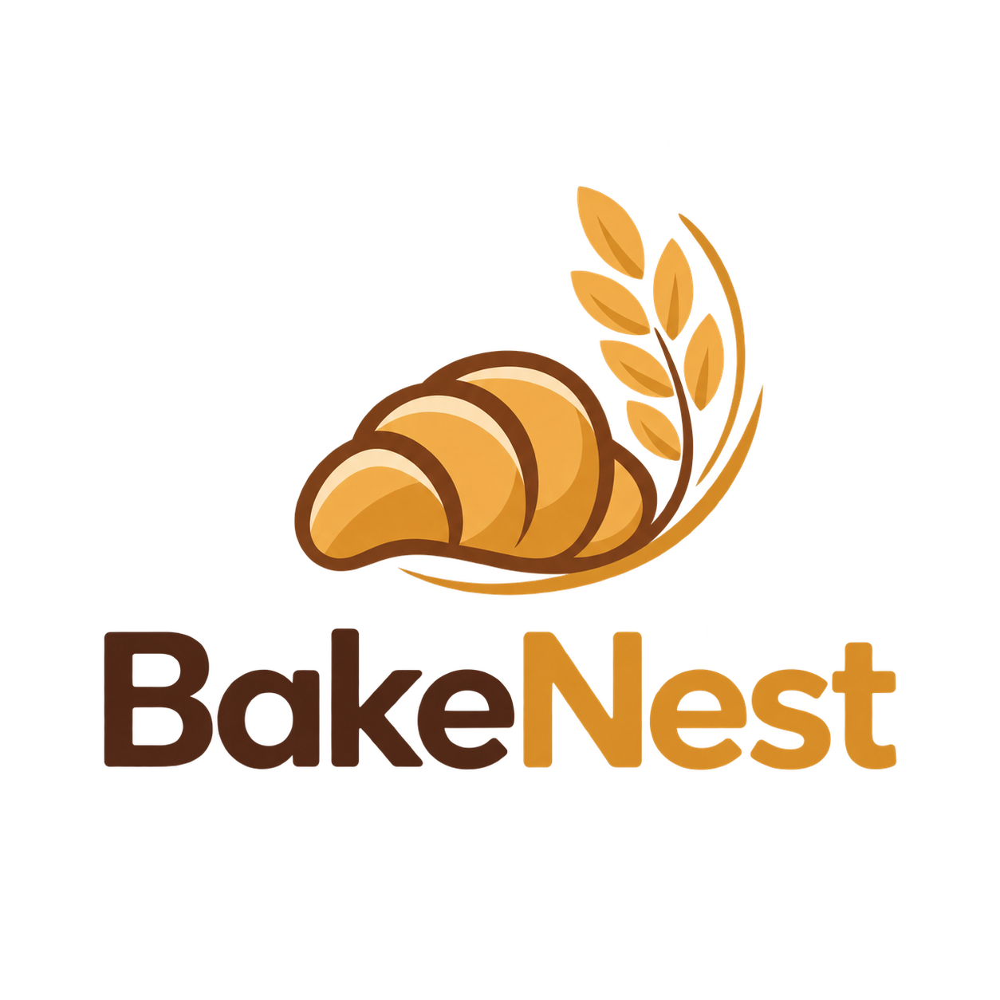

# BakeNest - Bakery Management System

## 📌 Project Overview

**BakeNest** is a web-based Bakery Management System developed as a software engineering practicum project.

The system is designed to automate bakery operations by connecting customers and administrators through a centralized platform. It provides product management, online ordering, custom cake requests, inventory automation, production tracking, payment simulation, and business reporting.

The main goal of this project is to create an efficient digital solution for managing bakery sales, inventory, and customer services.

---

#  Features

##  Customer Features

- Customer registration and login
- Browse bakery products
- View product details
- Add products to cart
- Checkout system
- Order history tracking
- Custom cake ordering
- Custom order status tracking
- Fake payment gateway simulation
- Profile management

---

##  Admin Features

### Dashboard
- Business overview
- Product statistics
- Order statistics
- Customer statistics
- Inventory status

### Product Management
- Add products
- Edit products
- Delete products
- View product details
- Manage product variants

### Recipe Management
- Create recipes
- Assign ingredients
- Set required ingredient quantities
- Edit and delete recipes
- View recipe details

### Inventory Management
- Ingredient management
- Stock monitoring
- Low stock alerts
- Inventory transaction history

### Production Management
- Record bakery production
- Automatically consume ingredients based on recipes
- Track production history

### Order Management
- View customer orders
- Update order status
- Manage order processing

### Custom Order Management
- Review customer requests
- Provide price quotation
- Accept/reject requests
- Complete custom orders

### Customer Management
- View customers
- View customer details
- Restrict/unrestrict accounts
- View order history
- View custom order history

### Reporting
- Sales reports
- Inventory reports
- PDF report generation

---

# 🛠️ Technology Stack

## Backend

- PHP 8.2
- Laravel 12
- MySQL

## Frontend

- Blade Templates
- Tailwind CSS
- JavaScript
- Lucide Icons

## Development Tools

- Visual Studio Code
- XAMPP
- Composer
- Node.js & NPM
- Git & GitHub

---
